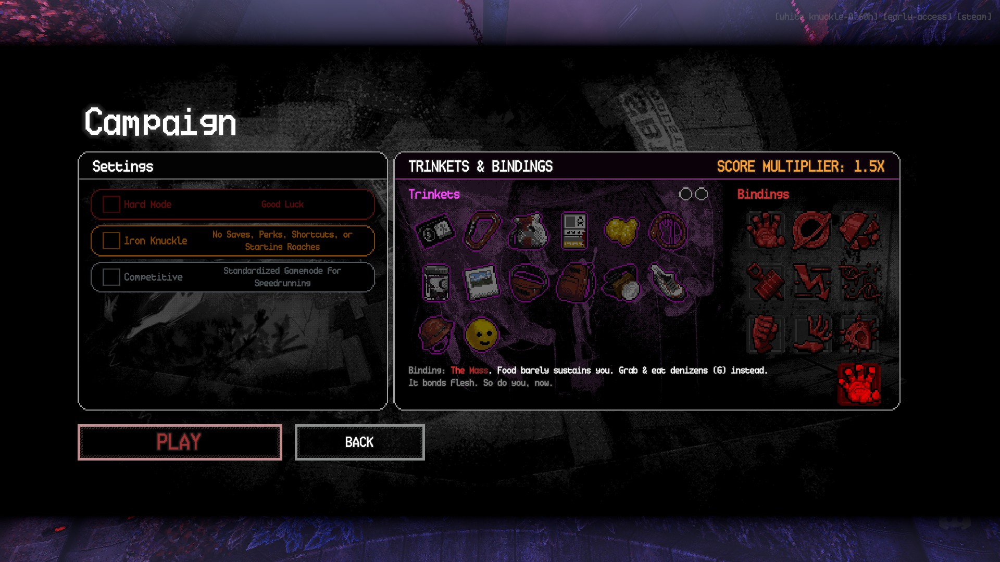

This mod and other mods for white knuckle from me are abandoned. Both the modders in the modding community and the devs have made it clear that AI-Assisted work is considered "AI-Generated". That my use case of it is "wrong" and that i am not allowed to overcome my disability to do what i enjoy. Too the point it disgusts me. I have deprecated my thunderstore page and for the co-op mod i was working on, it will be archived and abandoned. If the day comes that white knuckle decides not to blanket hate AI, then i will consider continuing work on projects.

# The Mass Binding

A [White Knuckle](https://store.steampowered.com/app/2881650/White_Knuckle/) mod that adds **The Mass**, a new Binding: hunger only refills from eating denizens — or from "Denizen Meat" collected from them — instead of normal food. Eating enough denizens mutates you but your hunger grows each time.
[Thunderstore](https://thunderstore.io/c/white-knuckle/p/JEG_Development/The_Mass_Binding/) [Discord](https://discord.gg/dAUp9E6CdD)
[](https://youtu.be/kkRDp-EnqT8)

## Features

- Adds a real, selectable Binding ("The Mass") to the Trinkets & Bindings picker, alongside the game's own bindings.
- Regular food barely sustains you; hunger is meant to be refilled by eating denizens instead.
- Grab a denizen with both hands, then: (NOTE: you do not NEED to grab them, simply holding both grab buttons and aiming at them should work.)
  - **Eat it directly** — kills it, restores hunger immediately, and counts toward the next perk reward.
  - **Turn it into Denizen Meat** — kills it and gives you a meat item you can eat later for hunger. Doesn't count toward the reward on its own; that's earned by the kill.
- Eating enough denizens grants a random perk. The number needed grows after each reward. You start off at 5, and it grows by 5 each perk gotten. You can obtain any perk including even perks (or debuff) outside of broken or shattered limbs.
- If another perk you pick up also brings its own hunger meter (e.g. Conditioned Polyphagia), it's kept in sync with The Mass instead of running as a separate, disconnected system.
- Fully configurable: hunger decay/restore rates, reward thresholds, keybinds, and more.
- Eating or turning into meat a Grub is considered forsaking you humanity and as such doing it once disgusts mother. (AKA eat or turn a grub into meat and you go to hotzone)

## Controls

Hold both grab buttons on a denizen, then press:

| Key | Action |
|-----|--------|
| `G` | Eat the denizen directly (restores hunger, counts toward the reward) |
| `X` | Turn the denizen into Denizen Meat (restores hunger when eaten later) |

Both keys are rebindable in the config.

## Installation

### Thunderstore / r2modman / Gale
Install through your mod manager of choice as normal — search for **The Mass Binding** and click install.

### Manual
1. Download the release zip.
2. Extract `TheMassBinding.dll` into your BepInEx plugins folder:
   `<profile>/BepInEx/plugins/TheMassBinding/TheMassBinding.dll`
3. Launch the game through your mod manager (or a BepInEx-patched install) so the plugin loads.

## Configuration

Settings are written to `BepInEx/config/com.vilcan.themassbinding.cfg` after the first run, or editable in-game via a mod config manager.

| Setting | Section | Default | Description |
|---|---|---|---|
| `HungerDecayMultiplier` | Hunger | `1.0` | Multiplier on the hunger decay rate. `1.0` = same pace as vanilla Survival Mode. |
| `NerfedFoodFraction` | Hunger | `0.1` | Fraction of normal food's hunger restore that still applies while The Mass is active. |
| `DenizenEatRestoreMultiplier` | Hunger | `1.0` | Hunger restored by eating a denizen directly, as a multiple of a normal meal. |
| `DenizenMeatEatMultiplier` | Hunger | `1.0` | Hunger restored by eating Denizen Meat, as a multiple of a normal meal. |
| `StartingMeatCount` | Hunger | `3` | Denizen Meat granted when you take the binding, in case you can't find a denizen right away. |
| `StartingThreshold` | Perks | `5` | Denizens eaten needed for the first random perk. |
| `ThresholdStep` | Perks | `5` | How much the required count increases after each perk reward. |
| `SyncForeignHungerModules` | Perks | `true` | Keeps a hunger module from another perk (e.g. Conditioned Polyphagia) tuned to match and fed by The Mass, instead of left as an unrelated system. (don't turn false it will break things) |
| `EatKey` | Controls | `G` | Key to eat a grabbed denizen directly. |
| `FoodMakerKey` | Controls | `X` | Key to turn a grabbed denizen into Denizen Meat. |
| `EatRange` | Controls | `3.0` | Max distance to a denizen for the eat prompt to register. |
| `VerboseLogging` | Debug | `false` | Per-frame eat-detection logging, for troubleshooting only. |

## Compatibility

Works alongside other perk/binding mods. If a granted perk introduces its own hunger meter, The Mass syncs with it rather than conflicting — see `SyncForeignHungerModules` above.

## Building from source

Requires the .NET SDK, BepInEx 5 core files, and a copy of the game's `Managed` folder.

```
dotnet build -p:BepInExDir="C:\...\BepInEx\core" -p:GameManagedDir="C:\...\White Knuckle_Data\Managed"
```

Default paths are pre-filled in `TheMassBinding.csproj` for a typical r2modman setup; override them with the flags above if yours differ.

## Known limitations

- Hunger-syncing with a foreign perk module only covers `PerkModule_HungerMeter`-based perks; unrelated hunger/food mods aren't accounted for.
- Denizen detection uses a raycast from the camera, so extremely thin or unusual denizen colliders may occasionally miss.

## License

MIT — see [LICENSE](LICENSE) if included, or adapt as needed for your release.
